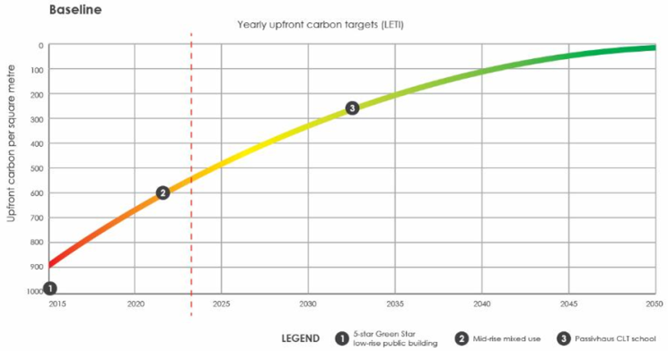

Most buildings today embed half their lifetime carbon before anyone turns on a light. Conversations about sustainability in buildings still focus on operational energy - heating, cooling, lighting, and the energy consumed over decades of use. But as the grid decarbonises the carbon we fix into the building at the outset matters more than ever. [Upfront carbon](https://www.linkedin.com/pulse/reducing-embodied-carbon-buildings-jason-gaekwad) — the emissions generated in extracting, manufacturing, transporting, and assembling materials — can be [50% or more of a building’s lifetime greenhouse footprint](https://www.mckinsey.com/industries/infrastructure/our-insights/reducing-embodied-carbon-in-new-construction?utm_source=chatgpt.com).

Yet in my experience, developers and designers often overlook this metric when making early project decisions. Brief development and concept design, where design choices have the most leverage, often proceed without visibility of how structure, materials, and geometry influence carbon outcomes. My experience shows that the highest-impact decisions happen during these early stages, not during late-stage specification or optimisation.

## Learning from practice: Case studies in upfront carbon reduction

In some of my [recent project work](https://www.linkedin.com/pulse/design-like-its-2035-case-studies-reducing-upfront-jason-tyujc), I plotted the upfront carbon in several project against recognised upfront carbon targets. Some clear patterns emerged:

- **Material substitution alone** such as partial cement reduction in concrete mixes, can reduce upfront carbon intensity by roughly 15-20% without major redesign. This is a baseline move that should be standard practice today, yet it is often overlooked.
- **Major design changes** like the extensive use of engineered timber, novel low‑carbon concrete alternatives, renewable or recycled materials, and reuse of existing materials, are what push projects ahead of our predicted decarbonisation trajectory. These case studies demonstrate that such interventions shift performance significantly closer to what a 2030/2035 climate trajectory demands.
- **Combined strategies** integrating material choice with design decisions such as compact massing, reduced surface area, and structural optimisation, amplify gains. For example, Passivhaus‑level operational building performance favours a low building envelope to floor area ratio, not only lowering operational energy needs but reducing material quantity, leading to lower embodied carbon.

These examples show that early, carbon-informed project decisions are practical, measurable, and impactful. The case studies also revealed a gap in current benchmarks: projects can meet Green Star requirements yet still miss absolute upfront carbon targets without deeper design shifts.

## Why early design decisions matter most

Once structure, materials, and spatial arrangement are fixed, reducing carbon becomes challenging. Decision-making must therefore intersect with technical insight at the earliest stages:

- Design teams, architects, and developers need accessible tools, clear data, and unambiguous targets early
- Trade‑offs must be visible (e.g., thermal performance vs carbon intensity)
- Decisions should align with realistic pathways to 2035 targets and beyond

In my consulting work, I guide teams through these trade-offs, helping them interpret complex metrics and act decisively, ensuring early decisions reflect both environmental and human outcomes. Additionally, in Australia, NABERS has recently released [tools and targets for embodied carbon](https://www.nabers.gov.au/ratings/our-ratings/nabers-embodied-carbon), giving teams concrete benchmarks to guide early-stage decisions.

## Beyond the numbers: integrating design and experience

The decisions that make a low-carbon building also align with better human outcomes, for example, compact massing can improve daylight access and design for reuse can strengthen cultural and economic value. These are the kinds of connections between environmental performance and human experience that rarely come out of commoditised sustainability checklists.

We need to think and design for the future, which means:

- Acknowledging that upfront carbon is not a technical footnote but a primary performance metric
- Recognising that early interdisciplinary design work has the greatest leverage
- Using case evidence to inform real, actionable decisions, not just aspirational statements

These insights are drawn from projects where early choices have measurably influenced both environmental and human outcomes. My goal in sharing them is to demonstrate that effective early decision-making is achievable and being used on higher performing projects, defining the buildings we will want to inhabit in a climate-constrained future.

If you’re a developer, financier, architect, or project lead facing upfront carbon challenges, I’d welcome discussion on tools, frameworks, and lessons from concept design to delivery.
