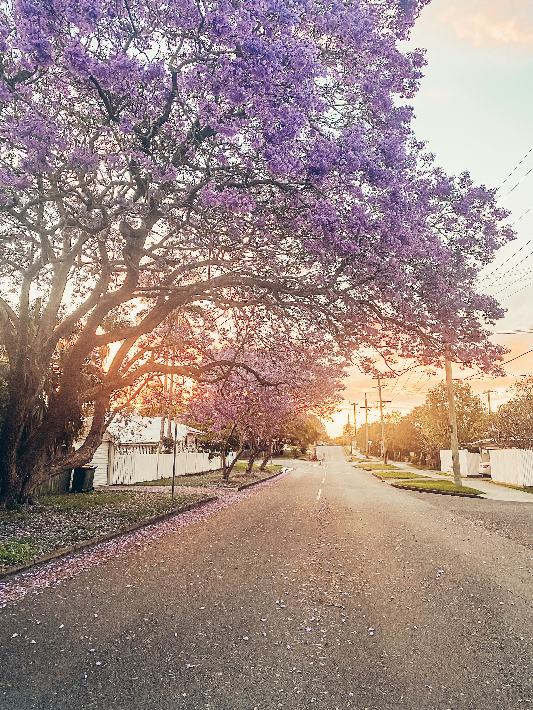
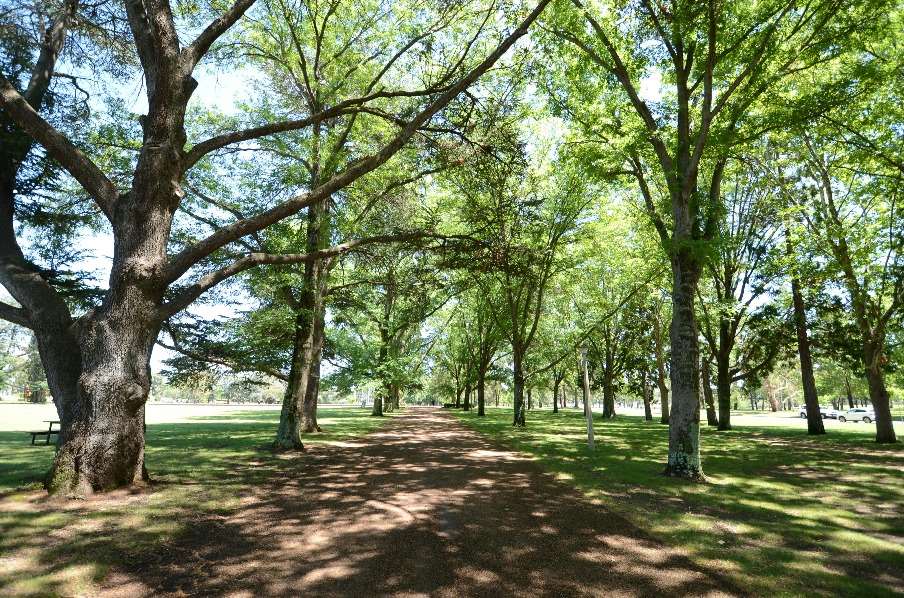

*Photo by Samantha Gilmore on Unsplash.*

This article was initally [published on LinkedIn](https://www.linkedin.com/pulse/nature-urban-infrastructure-mental-health-jason-c1gmc) on 5th March 2026 as part of my [*Future Built*](https://www.linkedin.com/newsletters/future-built-7375700034698280960) newsletter.

Cities are typically designed around physical infrastructure, which supports our lifestyles and well-being. Water and waste systems support sanitation and public health. Energy systems make the built environment habitable and productive. Buildings provide us with a habitat. Transport networks move people and goods.

But there is another form of infrastructure that receives far less attention: access to nature.

# Evidence from recent research

In a [recent meta-analysis](https://www.researchgate.net/publication/360902992_A_Meta-Analysis_of_Emotional_Evidence_for_the_Biophilia_Hypothesis_and_Implications_for_Biophilic_Design?trk=article-ssr-frontend-pulse_little-text-block) synthesising experimental studies of nature exposure, we analysed changes in emotional states across a large number of participants and environments. Across studies, exposure to natural settings was associated with consistent shifts in emotional state, including increases in positive emotions and reductions in negative emotions.

These effects are notable not only because they were rigorously determined, but because of what they imply about the role of nature in our everyday experiences. In many cases, the exposures examined were relatively brief, often involving short walks or quiet observation within natural spaces. The benefits did not require extended wilderness experiences.

This suggests that short-term, modest encounters with nature, such as urban parks, gardens, or views of greenery, may meaningfully and measurably influence how people experience buildings, workplaces, and neighbourhoods.

*Urban parks can represent reasonably short-term, modest encounters with nature. However, this level of engagement may be enough to have positive psychological effects for city dwellers. Photo by Michael on Unsplash.*

# Nature as psychological infrastructure

By framing nature in this way, it may be more accurate to think of urban nature as a form of psychological infrastructure that supports emotional wellbeing, rather than simply amenity or landscaping. This aligns with one of the foundational concepts of biophilic design, which requires meaningful and repeated engagement with nature, rather than the more popular and diluted aesthetic design interventions which are commonly shared.

This perspective aligns with growing recognition of mental health as a major public health challenge. Urban populations continue to grow, and many people spend the majority of their time indoors, in built environments. Similarly, rates of stress, anxiety, and other mental health challenges remain high.

In this sense, nature may represent a form of infrastructure that operates in the background, supporting emotional wellbeing in ways that often unrecognised or overlooked, providing an ‘ecosystem service’ of increasing human well-being.

# Implications

As cities continue to densify, understanding and integrating this dimension of built environment design will become increasingly important. If access to nature shapes emotional experience in consistent and measurable ways, then incorporating nature into urban environments is not only a question of aesthetics or amenity, but also a question of public health.

For the built environment professions, this raises an important practical question: how might cities and buildings better support sustained and meaningful contact with nature? These encounters may influence how people experience workplaces, homes, and neighbourhoods on a daily basis, shaping comfort, satisfaction, and perceived quality of place.

This article draws on research published in [Frontiers in Psychology](https://www.frontiersin.org/journals/psychology/articles/10.3389/fpsyg.2022.750245/full?trk=article-ssr-frontend-pulse_little-text-block&utm_medium=website&utm_source=archdaily.com.br).

